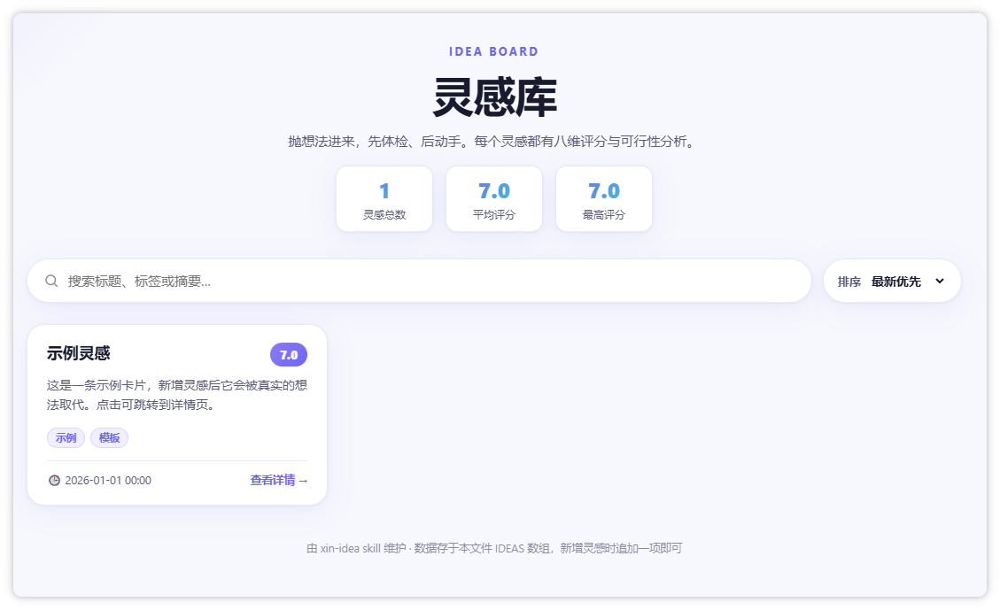
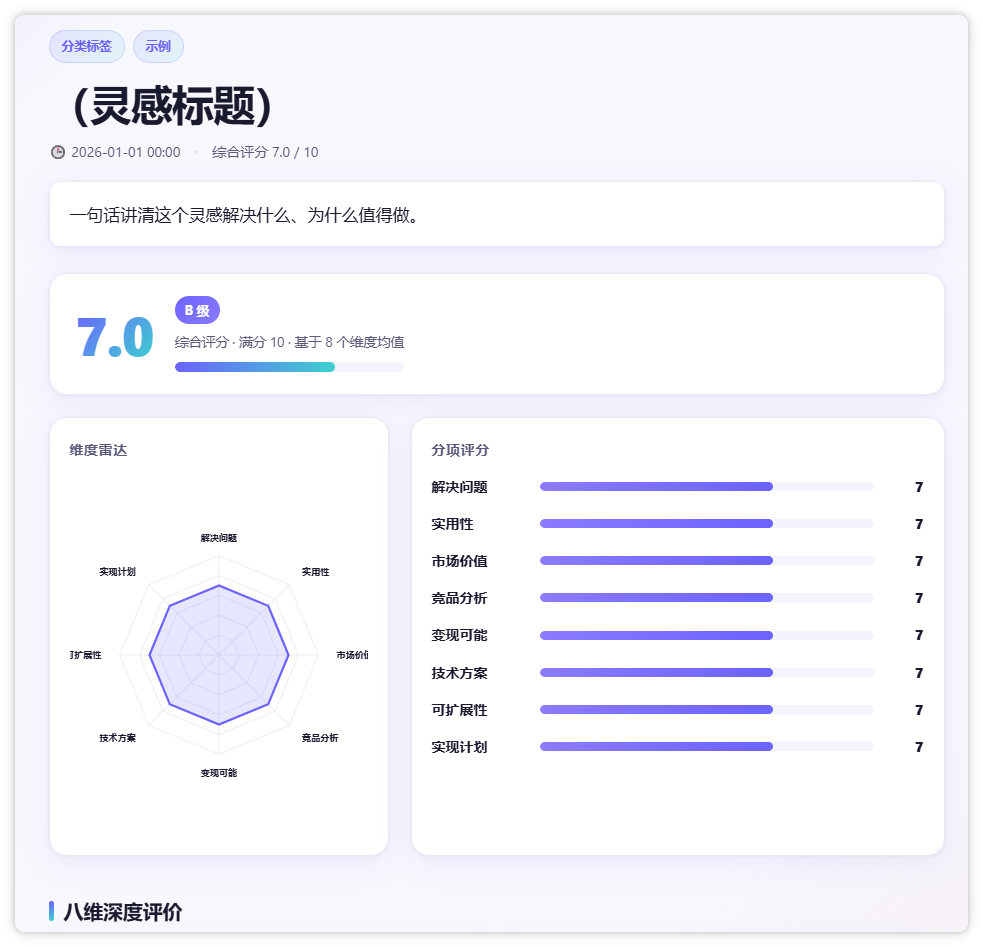

# xin-ideas · 灵感体检与可落地拆解

> 把想法抛进来，先体检、后动手。一个开源中文 skill：对每个灵感做「八维评分 + 可落地拆解」，产出精美、纯静态、完全离线的 HTML 详情页与可检索的灵感卡片墙。

本仓库只包含 skill 本体与模板，**不包含任何灵感数据**——你的想法只保存在本地工作区。

## ✨ 特性

- **八维评分（1–10）**：解决问题 / 实用性 / 市场价值 / 竞品分析 / 变现可能 / 技术方案 / 可扩展性 / 实现计划，按均值评级（S/A/B/C/D）
- **可落地拆解**：好处与代价、问题与应对、分阶段路线图、要避免的坑、量化成功/失败判据、成本投入（精力/时间/金钱），标准是「照着拆解，另一个人也能开工」
- **精美自包含页面**：雷达图（内联 SVG）、分项打分条、时间线路线图、判据表、成本卡；零 CDN、零外部请求，纯静态离线可用
- **灵感卡片墙**：实时搜索、多维度排序、点击跳转详情
- **原话留痕**：每个灵感忠实记录你的原始表达；明细页原话引用块，列表卡片「原话」标签悬停、聚焦或点击即时回看
- **深浅色主题**：右下角一键切换，默认浅色并记住偏好
- **移动端优先**：单栏布局、大触控目标、安全区适配，手机浏览体验优先
- **顺手的小交互**：卡片在新标签页打开明细、明细页一键关闭、可拖动的「返回顶部」浮动按钮（随手拖开，不遮挡内容）
- **增量维护**：复用同一个 `.xin-ideas/` 目录时只增不删，绝不覆盖或丢失已有灵感
- **隐私友好**：灵感数据为本地运行时产物，已默认被 `.gitignore` 排除

## 📁 目录结构

```
xin-ideas/
├── xin-ideas/                  # skill 本体（整体复制到 skills 目录即可安装）
│   ├── SKILL.md                # skill 定义与完整工作流（评分标准、产物约定、质量红线）
│   └── assets/
│       └── templates/          # 渲染模板（改动时只动数据对象）
│           ├── detail.html     # 灵感明细页模板
│           └── index.html      # 灵感索引页模板（卡片墙）
├── xin-ideas.zip               # 发布包：下载后可直接导入 agent 工具使用
├── docs/
│   └── screenshots/            # README 效果预览截图
├── README.md                   # 本文件
├── LICENSE                     # MIT 开源协议
└── .gitignore                  # 排除灵感数据、打包产物、IDE/系统文件
```

## 🚀 安装

**方式一：zip 直接导入（推荐，无需克隆仓库）**

1. 下载仓库根目录的 `xin-ideas.zip`
2. 直接导入到 workbuddy 等支持 skill 的 agent 工具即可使用

**方式二：skills.sh 一键安装（需 Node.js/npx）**

```bash
npx skills add oscar-wang-xin/xin-ideas
```

**方式三：复制到 skills 目录**

1. 克隆或下载本仓库
2. 将 `xin-ideas/` 整个目录复制到你所用工具的 skills 目录，例如：
   - Claude Code：`~/.claude/skills/`
   - Codex：`~/.codex/skills/`
   - 或你所用 agent 工具约定的 skills 目录
3. 在对话中触发：
   - 「收集灵感」「记个想法」「灵感库」「记一笔」
   - 「做个灵感评估」「给这个想法打个分」
   - `xin-ideas`

> 依赖：需要类 Unix shell 环境支持 `date +%Y%m%d_%H%M%S` 生成时间戳；输出页面为标准 HTML，无需任何构建工具。

## 📝 使用

调用 skill 后，它会在**选定的 `.xin-ideas/` 目录**内自动完成（首次使用会弹窗确认目录创建位置，默认为本 skill 安装目录，之后可随时更换）：

| 产物 | 位置 | 说明 |
|------|------|------|
| 灵感索引页 | `.xin-ideas/index.html` | 卡片墙，支持搜索/排序/跳转 |
| 灵感明细页 | `.xin-ideas/ideas/idea_<时间戳>.html` | 八维评分 + 完整拆解 |

> 所有产物集中在 `.xin-ideas/` 一个目录内，复制整个目录即可完成备份或迁移。**重复使用同一目录时按增量方式更新**：已有灵感只增不删；若 `index.html` 结构不一致，会先备份为 `index.html.bak`、提取原有全部灵感后重建，绝不丢失历史内容。

每个灵感包含：原话引用、一句话结论、八维分数与评价、收益 vs 代价、问题与应对、落地路线图、要避的坑、量化判据、成本量级。

**效果预览**

`.xin-ideas/index.html` 灵感库索引页（搜索、排序、跳转详情，「原话」标签悬停或点击查看原话）：



`.xin-ideas/ideas/idea_<时间戳>.html` 灵感明细页（原话引用、雷达图、分项评分、完整拆解）：



> 截图为模板示例数据，非真实灵感。

## 🔒 隐私说明

- **灵感数据（`.xin-ideas/` 目录，含 `index.html` 与 `ideas/` 子目录）是你的运行时产物，可能包含个人想法与敏感信息**，已写入 `.gitignore`，不会被 `git add`/提交。
- 本仓库仅含 skill 指令与模板文件，不含任何真实灵感数据，可放心开源。
- 所有页面均为纯静态、零外部网络请求，数据只存于你的本地工作区，不上传任何服务器。

## 📄 许可证

[MIT](LICENSE) © 2026 xin-ideas contributors

---

# xin-ideas · Idea Health Check & Actionable Breakdown (English)

> Toss an idea in — examine it first, build later. An open-source skill that runs every idea through an 8-dimension scorecard plus an actionable breakdown, producing beautiful, fully static, offline HTML detail pages and a searchable idea wall.

This repository contains only the skill itself and its templates — **no idea data**. Your ideas live exclusively in your local workspace.

## ✨ Features

- **8-dimension scoring (1–10)**：Problem-solving / Practicality / Market value / Competitive analysis / Monetization / Technical feasibility / Scalability / Implementation plan, graded S/A/B/C/D by average
- **Actionable breakdown**：benefits & costs, risks & mitigations, phased roadmap, pitfalls to avoid, quantified success/failure criteria, and cost estimates (effort/time/money) — "another person could start working from this breakdown"
- **Beautiful self-contained pages**：radar chart (inline SVG), per-dimension score bars, roadmap timeline, criteria table, cost cards; zero CDN, zero external requests, fully static and offline
- **Idea wall**：real-time search, multiple sort orders, click-through to detail
- **Raw idea capture**：every idea keeps your original words; a quote block on the detail page and a hover/tap "原话" tag on cards
- **Light / dark theme**：one-tap toggle at the bottom-right, defaults to light and remembers your choice
- **Mobile-first**：single-column layout, large touch targets, safe-area aware, tuned for phone browsing
- **Handy interactions**：cards open details in a new tab, a one-tap close button on the detail page, and a draggable "back to top" button (drag it aside so it never covers content)
- **Incremental by design**：reusing the same `.xin-ideas/` folder only appends; nothing existing is ever overwritten or lost
- **Privacy-friendly**：idea data is generated locally at runtime and excluded by default via `.gitignore`

## 📁 Directory Structure

```
xin-ideas/
├── xin-ideas/                  # The skill itself (copy the whole folder into your skills dir)
│   ├── SKILL.md                # Skill definition & full workflow
│   └── assets/
│       └── templates/          # Render templates (only edit the data object)
│           ├── detail.html     # Idea detail page template
│           └── index.html      # Idea index/wall template
├── xin-ideas.zip               # Release package: download and import directly into agent tools
├── docs/
│   └── screenshots/            # Screenshots used in README previews
├── README.md
├── LICENSE                     # MIT License
└── .gitignore
```

## 🚀 Installation

**Option 1: Import the zip (recommended — no cloning needed)**

1. Download `xin-ideas.zip` from the repo root
2. Import it directly into any skill-supporting agent tool such as workbuddy

**Option 2: Install via skills.sh (requires Node.js/npx)**

```bash
npx skills add oscar-wang-xin/xin-ideas
```

**Option 3: Copy into your skills directory**

1. Clone or download this repository
2. Copy the `xin-ideas/` folder into your agent's skills directory, e.g.：
   - Claude Code：`~/.claude/skills/`
   - Codex：`~/.codex/skills/`
   - or wherever your agent expects skills
3. Trigger it in a conversation with phrases like:
   - "collect an idea", "save this thought", "make an idea evaluation", "rate this idea"
   - or simply `` `xin-ideas` ``

> Requirement: a Unix-like shell supporting `date +%Y%m%d_%H%M%S` for timestamps; output is plain HTML, no build tooling needed.

## 📝 Usage

Once invoked, the skill produces everything inside the chosen `.xin-ideas/` folder (the first use asks where to create it, defaulting to the skill install directory):

| Artifact | Location | Description |
|----------|----------|-------------|
| Idea index page | `.xin-ideas/index.html` | Card wall with search / sort / navigation |
| Idea detail page | `.xin-ideas/ideas/idea_<timestamp>.html` | 8-dimension scores + full breakdown |

> All artifacts live in the single `.xin-ideas/` folder; copy the whole folder to back up or migrate. **Updates to an existing folder are incremental**: existing ideas are only appended to, and if `index.html` has a mismatched structure it is first backed up to `index.html.bak` and the original links are carried over when rebuilding, so nothing is ever lost.

Every idea includes: the original raw words, a one-line takeaway, 8-dimension scores and reviews, benefits vs. costs, risks & mitigations, a phased roadmap, pitfalls to avoid, quantified success/failure criteria, and cost magnitude.

**Preview**

`.xin-ideas/index.html` — the idea wall (search, sort, click-through; hover or tap the "原话" tag to see the raw words):


`.xin-ideas/ideas/idea_<timestamp>.html` — the idea detail page (raw quote, radar chart, dimension scores, full breakdown):


> Screenshots show template placeholder data, not real ideas.

## 🔒 Privacy

- **Your idea data (the `.xin-ideas/` folder, including `index.html` and the `ideas/` subfolder) is a runtime artifact and may contain personal or sensitive thoughts** — it is already covered by `.gitignore` and will never be committed.
- This repository contains only skill instructions and templates — no real idea data, safe to open-source.
- All pages are fully static with zero external network requests; data stays in your local workspace and is never uploaded anywhere.

## 📄 License

[MIT](LICENSE) © 2026 xin-ideas contributors